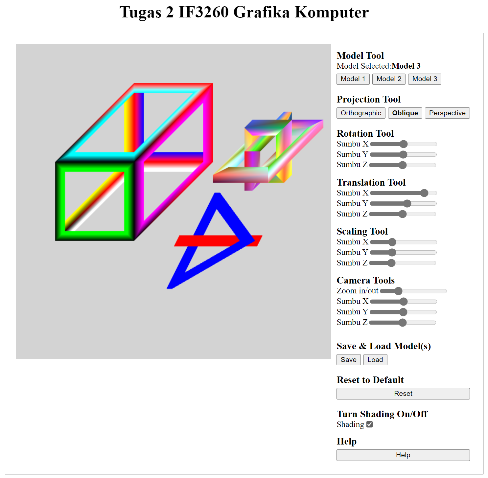
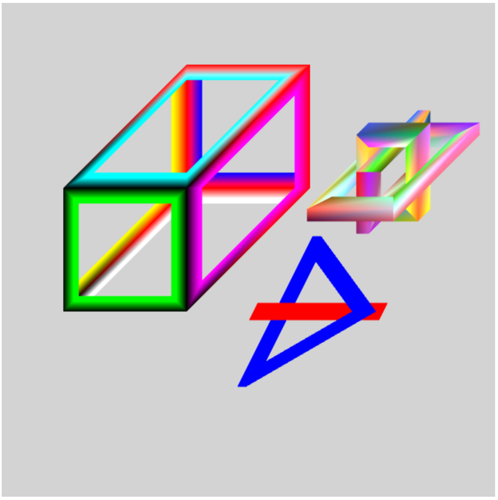

# IF3260_Tugas2_K03_G12

<table>
    <tr>
        <td colspan = 3 align = "center">
            KELOMPOK 12 - K03
        </td>
    </tr>
    <tr>
        <td align="center">No</td>
        <td align="center">Nama</td>
        <td align="center">NIM</td>
    </tr>
    <tr>
        <td align="center">1</td>
        <td align="center">Fernaldy</td>
        <td align="center">13520112</td>
    </tr>
    <tr>
        <td align="center">2</td>
        <td align="center">Bryan Amirul Husna</td>
        <td align="center">13520146</td>
    </tr>
    <tr>
        <td align="center">3</td>
        <td align="center">Willy Wilsen</td>
        <td align="center">13520160</td>
    </tr>
</table>

## 3D WebGL Hollow Object

### Table of contents
* [Overview](#overview)
* [How to Run](#how-to-run)
* [Models Sample](#models-sample)
* [Checklist dan Pembagian Tugas](#checklist-dan-pembagian-tugas)

### Overview

Pengguna dapat berkreasi melalui interaksi dengan kanvas menggunakan berbagai tools yang tersedia pada bagian sebelah kanan dari kanvas. Untuk menentukan jenis objek yang akan dimodifikasi, pengguna dapat memilih sendiri melalui model tool yang telah disediakan. Terdapat pula berbagai fungsionalitas yang dapat membantu pengguna dalam melakukan perubahan pada gambar yang telah dicetak pada kanvas, yang mana fungsionalitas-fungsionalitas ini terdapat pada pada dokumentasi/laporan pada folder doc.

Selain itu, untuk menambah jenis objek yang akan digambar, pengguna dapat melakukan <i>import</i> objek yang ingin di gambar melalui button <i>load</i>. Objek yang di-<i>import</i> adalah <i>file</i> berformat <i>.json</i> dan memiliki atribut <i>vertices</i>, <i>colors</i>, dan <i>faces</i> di dalamnya. Setelah objek yang di-<i>import</i> dimodifikasi, pengguna dapat melakukan <i>save</i> melalui button <i>save</i> agar objek-objek tersebut dapat di-<i>load</i> kembali dalam kondisi setelah modifikasi. Sementara itu, terdapat juga button <i>reset</i> yang ketika diklik, seluruh objek yang telah dimodifikasi akan kembali ke dalam keadaan <i>default</i> yakni keadaan objek saat pertama kali di-<i>load</i>.

### How to Run
1. Buka folder src
2. Jalankan `index.html`

### Models Sample

### Checklist dan Pembagian Tugas
<table>
    <tr>
        <td colspan = 3 align = "center">
            Fitur Wajib
        </td>
    </tr>
    <tr>
        <td align="center">Spesifikasi</td>
        <td align="center">Terselesaikan</td>
        <td width="30%" align="center">Oleh</td>
    </tr>
    <tr>
        <td align="center">Membuat 3 buah file model</td>
        <td align="center"><strong>✓</strong></td>
        <td align="center">13520112 - Fernaldy 13520146 - Bryan Amirul Husna 13520160 - Willy Wilsen</td>
    </tr>
    <tr>
        <td align="center">Melakukan load model</td>
        <td align="center"><strong>✓</strong></td>
        <td align="center">13520146 - Bryan Amirul Husna</td>
    </tr>
    <tr>
        <td align="center">Mengubah jenis proyeksi (orthographic, oblique, perspective)</td>
        <td align="center"><strong>✓</strong></td>
        <td align="center">13520146 - Bryan Amirul Husna</td>
    </tr>
    <tr>
        <td align="center">Melakukan rotasi, translasi, dan scaling</td>
        <td align="center"><strong>✓</strong></td>
        <td align="center">13520160 - Willy Wilsen</td>
    </tr>
    <tr>
        <td align="center">Mengubah jarak (radius) kamera view dan memutar kamera</td>
        <td align="center"><strong>✓</strong></td>
        <td align="center">13520112 - Fernaldy</td>
    </tr>
    <tr>
        <td align="center">Me-reset ke default view</td>
        <td align="center"><strong>✓</strong></td>
        <td align="center">13520112 - Fernaldy</td>
    </tr>
    <tr>
        <td align="center">Membuat menu help</td>
        <td align="center"><strong>✓</strong></td>
        <td align="center">13520112 - Fernaldy 13520146 - Bryan Amirul Husna 13520160 - Willy Wilsen</td>
    </tr>
    <tr>
        <td align="center">Menambahkan warna dasar dengan teknik shading</td>
        <td align="center"><strong>✓</strong></td>
        <td align="center">13520112 - Fernaldy</td>
    </tr>
    <tr>
        <td colspan = 3 align = "center">
            Fitur Lanjutan
        </td>
    </tr>
    <tr>
        <td align="center">Loading lebih dari satu model secara bersamaan</td>
        <td align="center"><strong>✓</strong></td>
        <td align="center">13520160 - Willy Wilsen</td>
    </tr>
    <tr>
        <td align="center">Melakukan save model</td>
        <td align="center"><strong>✓</strong></td>
        <td align="center">13520146 - Bryan Amirul Husna</td>
    </tr>
    <tr>
        <td align="center">Animasi pada model</td>
        <td align="center"><strong>✗</strong></td>
        <td align="center">-</td>
    </tr>
    <tr>
        <td align="center">Implementasi shading manual tanpa fungsi bawaan GL</td>
        <td align="center"><strong>✓</strong></td>
        <td align="center">13520112 - Fernaldy</td>
    </tr>
    <tr>
        <td align="center">Shading dapat diganti warna dan arah sinarnya, atau dari titik sumber cahaya secara spesifik, bukan dari point of infinity</td>
        <td align="center"><strong>✗</strong></td>
        <td align="center">-</td>
    </tr>
    <tr>
        <td align="center">Implementasi bayangan dari objek pada hanya pada sebuah layar yang letaknya telah ditentukan</td>
        <td align="center"><strong>✗</strong></td>
        <td align="center">-</td>
    </tr>
</table>
